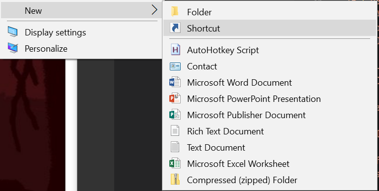
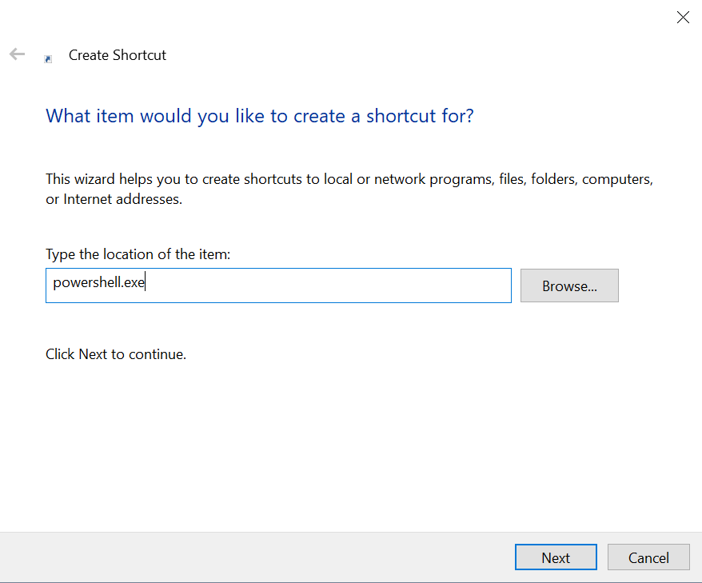
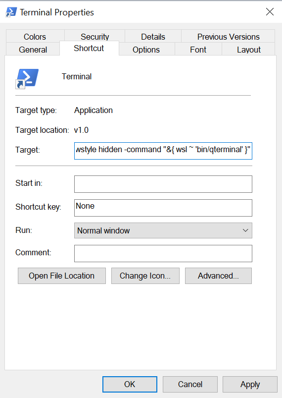

# WSL Scripts
A collection of useful scripts I use for Windows Subsystem for Linux.

You might find them useful too :)

#### Table of Contents
- [Installation](#installation)
- [Tips and Tricks](#tips-and-tricks)
    - [File Associations](#file-associations)
    - [Launching a GUI Terminal](#launching-a-terminal)

## Installation

You might find one of the following installation methods useful for your WSL environment:

- Clone this repo and use your shell's alias functionality to alias a useful command
    - e.g., `alias code=/path/to/vscode.sh` so you can run `code style.css`.
- Symlink scripts from this repo into your local or global bin directory
- Copy scripts you want into your local or global bin directory

## Tips and Tricks

### File Associations
There's a great project called [wsl-open](https://gitlab.com/4U6U57/wsl-open) that bridges the gap between xdg-open in WSL and your Windows desktop. I needed to modify a few things to get it working in my particular set up and I've included the modified source in this repo. Here's what I did:
1. Ensure `wsl-open.sh` is available in a bin directory (symlinked to `~/bin/wsl-open` in my case)
2. Copy `wsl-open.desktop` to `~/.local/share/applications/wsl-open.desktop` (or the global applications folder at `/usr/share/applications` if you want it globally accessible) and change the `Exec` line to point to the location of your wsl-open script.
3. 🤞*
4. Use xdg-open (or alias it like `alias open=xdg-open` if you're a macOS expat like me) and try opening a few things. `xdg-open http://example.com`, `xdg-open my-folder`, `xdg-open image.png`

`*` Truthfully, it might take some trial and error to get xdg to open the right applications. If you're using KDE 5/Plasma, for example, you'll want to open `systemsettings5` and check the *Applications* tab for file associations. With the high `InitialPreference` set in the desktop file, `wsl-open` should float to the top automatically, but your mileagle may vary.

`wsl-open` also has a few options for setting and clearing the file associations from the command line. Those may be enough for you (they, sadly, weren't for KDE).

### Launching a Terminal
Assuming you've successfully set up an X server (like [VcXsrv](https://sourceforge.net/projects/vcxsrv/)) and have a working installation of your favorite terminal emulator, you might want a convenient way of launching it from Windows.
#### 1. Create a new desktop shortcut


We'll be using `powershell.exe`. Click next, give it a easy to type name, and click next again to finish creating the shortcut.



#### 2. Modify the shortcut 
Right-click the new shortcut and click *Properties*. You'll want to modify the *Target* to something like so:
```
C:\Windows\System32\WindowsPowerShell\v1.0\powershell.exe -windowstyle hidden -command "&{ wsl ~ 'bin/qterminal' }"
```

This will make the PowerShell window disappear after running and execute a `~/bin/qterminal` (or what have you) shell script in WSL.



#### 3. Set up your WSL environment

I use Qterminal from the LXQt project for my terminal. My `~/bin/qterminal` from the shortcut above looks like:

```
#!/usr/bin/env zsh
source ~/.zshrc
SHELL=/bin/zsh /usr/bin/qterminal
```

And among the various things in my zshrc that gets sourced before running qterminal:
```
export DISPLAY=:0
export XDG_RUNTIME_DIR=~/.tmp
export QT_PLUGIN_PATH=$QT_PLUGIN_PATH:/usr/lib/x86_64-linux-gnu/qt5/plugins/kcms
export XDG_CURRENT_DESKTOP=LXQt
export XCURSOR_THEME=Breeze_Snow

# These are nice values for KDE
#export XDG_CURRENT_DESKTOP=KDE
#export KDE_SESSION_VERSION=5
#export DESKTOP_SESSION=plasma
#export OOO_FORCE_DESKTOP=kde

# If you keep `wgl` enabled for Xming or VcXsrv, you'll want this too
#export LIBGL_ALWAYS_INDIRECT=1
```

Depending on the GUI apps you like to use, you might not find most of these options
terribly useful, but if you're banging your head against a wall with theming (especially with Qt),
you might just be missing an environment variable or two.